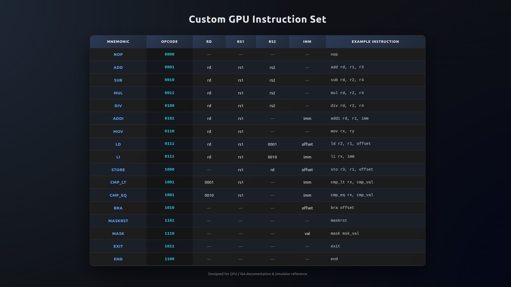

# 4-Lane SIMD GPU Architecture

A custom-designed, 4-lane SIMD (Single Instruction, Multiple Data) GPU architecture implemented in Verilog. This project demonstrates core GPU principles including parallel execution, warp scheduling with thread masking (divergence handling), and a dedicated Load/Store Unit (LSU).

Overview
----------------------------

The architecture is built around a **Single Instruction, Multiple Data** execution model. A single instruction is fetched and decoded once, then executed across four parallel lanes. Each lane contains its own ALU and Register File, allowing the processor to handle data-parallel tasks efficiently.

### Key Features

*   **4-Lane SIMD Core**: Parallel execution of arithmetic and logic operations across four independent lanes.
    
*   **Thread Masking & Divergence**: A Warp Scheduler manages an `active_mask`, enabling or disabling specific lanes during conditional execution (e.g., `IF/ELSE` branches) to handle divergent control flow.
    
*   **Unified LSU**: A Load/Store Unit(`LSU`) that manages memory arbitration and addressing for all four lanes, ensuring consistent data movement.
    
*   **Custom ISA**: Supports ALU operations, memory access, branching, and specialized masking instructions (`is_mask`, `is_maskrst`).
    
*   **Python-based Assembler**: Includes a custom assembler to compile `.asm` programs into `hex files` for hardware simulation.
    

Architecture Design
-----------------------

The GPU is divided into several functional blocks:

### 1\. Front-end (Fetch/Decode)

*   **gpu\_pc**: Handles the instruction pointer, stall logic, and branch offsets.
    
*   **gpu\_instr\_mem**: Stores the kernel instructions (`Instruction Memory`).
    
*   **gpu\_decoder**: Interprets the 32-bit opcode and generates control signals for the execution stage.
    

### 2\. Execution Core

*   **Lanes 0-3**: Each lane contains a `gpu_alu` for computation and a `gpu_reg` (Register File) for local storage.
    
*   **gpu\_cmp\_unit**: Aggregates comparison results from all lanes to determine branch conditions or update thread masks.
    

### 3\. Control & Scheduling

*   **gpu\_warp\_scheduler**: Manages the `active_mask` based on kernel state and comparison results. It ensures only the correct threads execute specific parts of divergent code.
    

### 4\. Memory Subsystem

*   **gpu\_lsu**: The interface between the execution lanes and `Data Memory`, handling address generation and `stall` logic.
    
*   **gpu\_dmem**: The primary data storage for the GPU kernel.
    

Project Structure
--------------------

```python
├── assembler               
│   └── gpu_assembler.py    # Main Python script for the assembler
├── assemble.sh             # Shell script to execute the assembler
├── design                  
│   ├── design.html         
│   ├── instructions.html   
│   └── instructions.jpg    
├── hex                     
│   ├── gpu_dmem.hex        # Hex file for Data Memory initialization
│   └── gpu_imem.hex        # Hex file for Instruction Memory initialization
├── program.asm             # Input assembly test program
├── README.md               
├── src                     # Verilog source files for the GPU hardware
│   ├── gpu_alu.v           
│   ├── gpu_cmp_unit.v      # Comparator Unit (LT, GT, EQ, etc.)
│   ├── gpu_decoder.v       # Instruction Decoder (Opcode to control signals)
│   ├── gpu_dmem.v          
│   ├── gpu_instr_mem.v     
│   ├── gpu_interface       
│   ├── gpu_lsu.v           # Load-Store Unit (Memory read/write logic)
│   ├── gpu_pc.v            # Program Counter (Fetch address logic)
│   ├── gpu_register.v      
│   ├── gpu_regwrite_gen.v  # Logic to generate register write enable signals
│   ├── gpu_reg_wr_src.v    
│   ├── gpu_top.v           # Top-level module integrating all GPU components
│   ├── gpu_warp_scheduler.v # Scheduler managing warps and execution flow
│   └── thread_RV_dmux.v    
└── verification            # Directory for testbenches and cocotb verification scripts
    ├── Makefile           
    └── test.py            
```


Instruction Set (ISA) Summary
---------------------------------

The GPU supports several instruction classes designed for parallel processing:

| Class | Instruction Type | Description |
| :--- | :--- | :--- |
| **ALU** | `ADD`, `SUB`, `AND`, `OR`, `MOV` | Performed across all currently active lanes. |
| **Memory** | `LOAD`, `STORE` | Managed by the LSU to transfer data between Registers and DMEM. |
| **Branch** | `BEQ`, `BLT`, `JUMP` | Changes PC based on lane comparison results. |
| **Masking** | `MASK`, `MASKRST` | Updates the `active_mask` to handle conditional (divergent) code blocks. |
| **Control** | `EXIT`, `END` | Signals completion of the current kernel execution. |

Signals completion of the current kernel execution.



Getting Started
-------------------
Note: In case your system fails to install `Cocotb`, make use of `Python environment` to install it.

### 1\. Assemble the Program

Use the provided Python assembler to convert your assembly source code into hex files compatible with Verilog `readmemh`:

```python
python3 assembler/gpu_assembler.py program.asm
```

### Alternatively

Just change the mode of `assemble.sh` to executable and run `./assemble.sh`

```bash
chmod +x assemble.sh
./assemble.sh
```

### 2\. Cocotb Based Verification

After assembling and extracting the hexcode, run the simulation using `Verilator` integrated with `Cocotb`.

To run this simply run the fillowing command in the terminal.

```python3
cd verification/
make SIM=Verilator WAVE=1
```

This generates `dump.vcd` file in the `gpu` directory.


## Data Flow

Instruction Fetch: The PC points to IMEM, and the instruction is fetched.

**Execution**: The Decoder signals ALUs. Lanes read from their respective Register Files, and the ALU result is generated.

**Memory Access**: For `LOAD/STORE` operations, the `LSU` uses the ALU results as addresses and manages data movement with `gpu_dmem`.

**Write-back**: The Write-back Mux (`gpu_reg_wr_src`) selects between ALU results, immediate values, or Memory Load data to update the Register Files.

